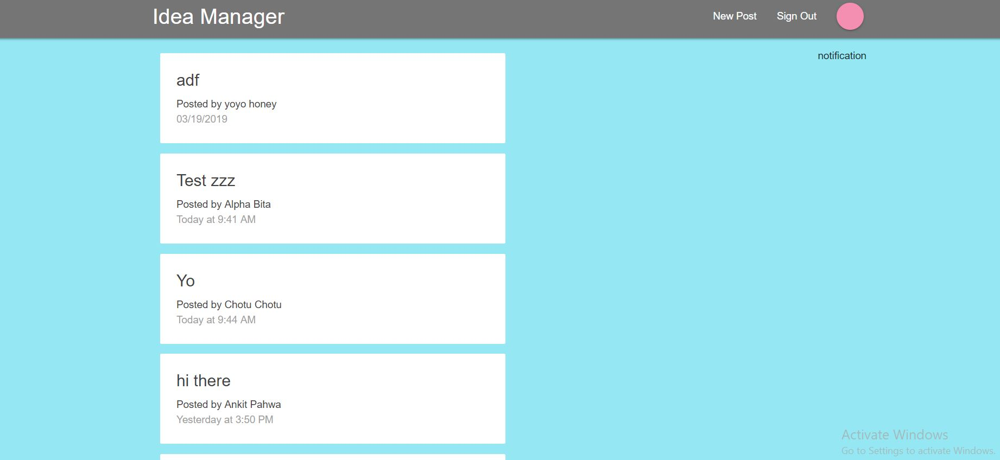

# Idea Manager #

This app is a SPA as Idea Manager/Viewer , where you can : 
* Login and Signup :thumbsup:
* View Other peoples ideas to contribute in them :clap:
* Add your own idea  :clap:
* View details of Idea by user along with timestamp :thumbsup:

### `Demo` ###

Demo of this app is Present at https://idea-manager-ankit.herokuapp.com/

### `Backend` ###

This app uses Firebase Services in Backend  
Firebase Cloud for notifications  
Firebase Auth for Authentication of users  
Firestore for cloud database

### `Frontend` ###

Frontend is built with ReactJS  
The CSS is adopted from materialize css

### `How to Start On local System` ###
 * Clone the repository 
 * run `npm install` to install dependencies
 * run `npm run build` to create build folder
 * run `npm start`
 * go to https://localhost:3000 to view app

 ## `App Info` ##
 #### Created By : Ankit Pahwa
 #### Version : 1.0.0
